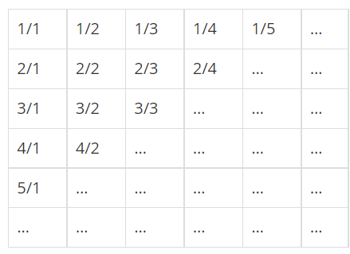

## 8단계 기본 수학 1
### #1712 손익분기점
```markdown
문제 설명
A만원의 고정 비용, B만원의 가변 비용, 가격이 C만원으로 책정

입력
첫째 줄에 A, B, C가 빈 칸을 사이에 두고 순서대로 주어진다. A, B, C는 21억 이하의 자연수이다.

출력
첫 번째 줄에 손익분기점 즉 최초로 이익이 발생하는 판매량을 출력한다. 손익분기점이 존재하지 않으면 -1을 출력
```
```python
A, B, C = map(int,input().split())
if C - B <= 0:
    print(-1)
else:
    x = int(A/(C-B)) + 1
    print(x)
```

### #2292 벌집
```markdown
문제 설명
중앙의 방 1부터 시작해서 이웃하는 방에 돌아가면서 1씩 증가하는 번호
N이 주어졌을 때, 벌집의 중앙 1에서 N번 방까지 최소 개수의 방을 지나서 갈 때 몇 개의 방을 지나가는지(시작과 끝을 포함하여)를 계산하는 프로그램

입력
첫째 줄에 N(1 ≤ N ≤ 1,000,000,000)이 주어진다.

출력
입력으로 주어진 방까지 최소 개수의 방을 지나서 갈 때 몇 개의 방을 지나는지 출력한다.
```
.png)
```python
N = int(input())

an = 1
n = 1
while True:
    an_1 = an
    if an >= N:
        print(n)
        break
    an = an_1 + 6 * n
    n += 1
```

### #1193 분수찾기
```markdown
문제 설명
1/1 → 1/2 → 2/1 → 3/1 → 2/2 → … 과 같은 지그재그 순서로 차례대로 1번, 2번, 3번, 4번, 5번...
X가 주어졌을 때, X번째 분수를 구하는 프로그램

입력
첫째 줄에 X(1 ≤ X ≤ 10,000,000)가 주어진다.

출력
첫째 줄에 분수를 출력한다.
```


```python
X = int(input())

n = 1
sum_n = 0
while True:
    sum_n += n
    if sum_n >= X:
        break
    n+= 1
# n이 짝수면 아래로
if n % 2:
    print(f'{sum_n-X+1}/{n-(sum_n-X)}')
else:
    print(f'{n-(sum_n-X)}/{sum_n-X+1}')
```

### #2869
```markdown
문제 설명
이 달팽이는 높이가 V미터인 나무 막대를 올라갈 것이다.
낮에 A미터 올라갈 수 있다. 하지만, 밤에 잠을 자는 동안 B미터 미끄러진다. 

입력
첫째 줄에 세 정수 A, B, V가 공백으로 구분되어서 주어진다. (1 ≤ B < A ≤ V ≤ 1,000,000,000)

출력
첫째 줄에 달팽이가 나무 막대를 모두 올라가는데 며칠이 걸리는지 출력한다.
```
```python
A, B, V = map(int, input().split())
date = (V-A) / (A-B)
if date == int(date):
    print(int(date)+1)
else:
    print(int(date)+2)

```