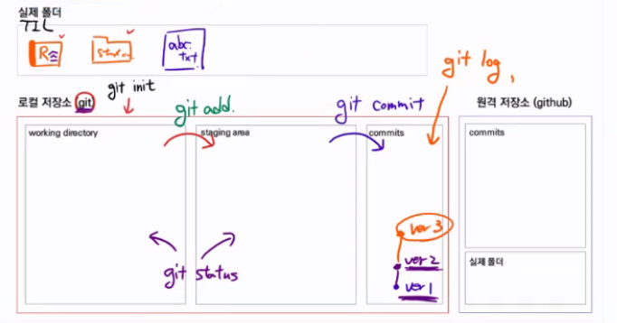

# Git

## 1. Git을 이용한 버전 관리

* **Git** : (분산) 버전 관리 프로그램

  - **버전** : 컴퓨터 소프트웨어의 특정 상태
  - **관리** : 어떤 일의 사무, 시설이나 물건의 유지, 개량
  - **프로그램** : 컴퓨터에서 실행될 대 특정 작업을 수행하는 일련의 명령어들의 모음

* 버전 관리 

  * 조건 없음

    ```
    레포트_최종.docx
    레포트_최최종.docx
    레포트_진짜최종.docx
    ```

  * 시간과 날짜 (가정: 레포트의 구분이 어렵다면?)

    ```
    레포트_최종_220113_1604.docx
    레포트_최최종_220114_1215.docx
    레포트_진짜최종_220115_0330.docx
    레포트_220115_1520.docx
    ```

  * 변경사항 기록 (가정: 레포트의 페이지가 많다면?)

    ```
    레포트_최종_220113_1604.docx
    레포트_최최종_220114_1215.docx
    레포트_최최종_변경사항_220114_1215.docx
    레포트_진짜최종_220115_0330.docx
    레포트_진짜최종_변경사항_220115_0330.docx
    레포트_220115_1520.docx
    ```

  * 변경 사항과 최종 상태만 저장 (가정: 레포트의 용량이 매우 크다면?)

    ```
    레포트_최최종_변경사항_220114_1215.docx
    레포트_진짜최종_변경사항_220115_0330.docx
    레포트_220115_1520.docx
    ```

  

  * Git은 작성자, 변경 위치, 변경 내용은 저장해준다.
  * 변경 이유는 작성 필요 - 인수인계에 도움

* 중앙 집중식 버전 관리

  * 중앙에서 모든 변경점 저장
  * 중앙 서버에서 자료 유실시 최종 프로그램만 남을 수 있음

* 분산 버전 관리

  * 변경점이 분산점마다 따로 저장
  * 프로그램 백업에 용이

---


## 2. Github를 이용한 포트폴리오

* Git에 자료를 올릴 때마다 잔디가 심어지고, 여러번 업로드 하면 잔디가 진해진다.
* 종류: Github, GitLab, Bitbucket


## 3. Git 설명


### Git 구조

**Day1**

```
실제 폴더

A.txt
B.txt
C.txt (빈파일)
Z.file (쓸모없는 파일)
```


```
Working Directory : 작업 공간

A.txt
B.txt
C.txt (빈파일)
Z.file (쓸모없는 파일)
```

```
staging Area : 검수하는 공간

A.txt
B.txt
C.txt (빈파일)
```

```
Local Repository (Commits)

Version1
A.txt
B.txt
C.txt (빈파일)
```


**Day2** : C.txt를 수정하여 업로드

```
실제 폴더

A.txt
B.txt
C.txt (파일 수정됨)
Z.file (쓸모없는 파일)
```


```
Working Directory : 작업 공간

C.txt
```

```
staging Area : 검수하는 공간

C.txt 
```

```
Local Repository (Commits)

Version2
version1
A.txt
B.txt
C.txt 
```



`window + shift + s`: 화면캡쳐

---


### Git 상태

* **untracked** : 관리되지 않고 있는 대상. 
  * 빨간색으로 표시
  * Working Directory에 처음으로 관리되는 대상
  * Staging Area에 올라가기 전 상태
* **tracked** : 관리되고 있는 대상
  * modified : add 되면 녹색으로 표시, add 전에는 빨간색으로 표시
    * 이전에 git에 올라가있었지만 수정된 파일
  * unmodified : 표시되지 않음

---


### Git bash 명령어

* `git init`  : 폴더에 로컬 git 저장소 생성

* `git status`  : 폴더의 git 상태 표시

* `git add`  : Working Directory --> Stage Area

* `git commit`  : Stage Area --> Local Repository

  * **vim 상태 명령어**

    `I`: Insert 상태로 바꿈

    `ESC` : Insert 상태 벗어남

    `w`  : write 저장

    `q`  : quit 나가기

    `wq`  : 저장하고 나가기

* `git commit -m '메세지'`  : commit 할 때 한 줄 주석 추가

---

* `git config --global user.email "이메일주소"` : git 이메일 주소 설정

* `git config --global user.name "git 이름"` : git 유저 네임 설정

* `git config --global -ㅣ`  : 설정 확인

  

